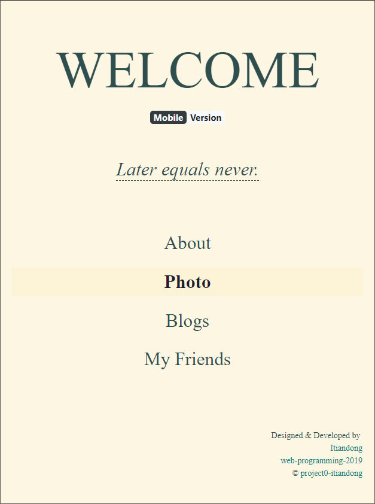
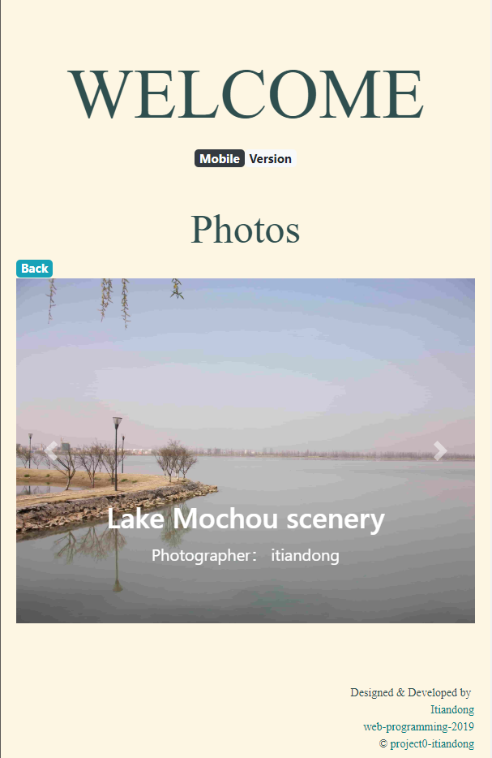
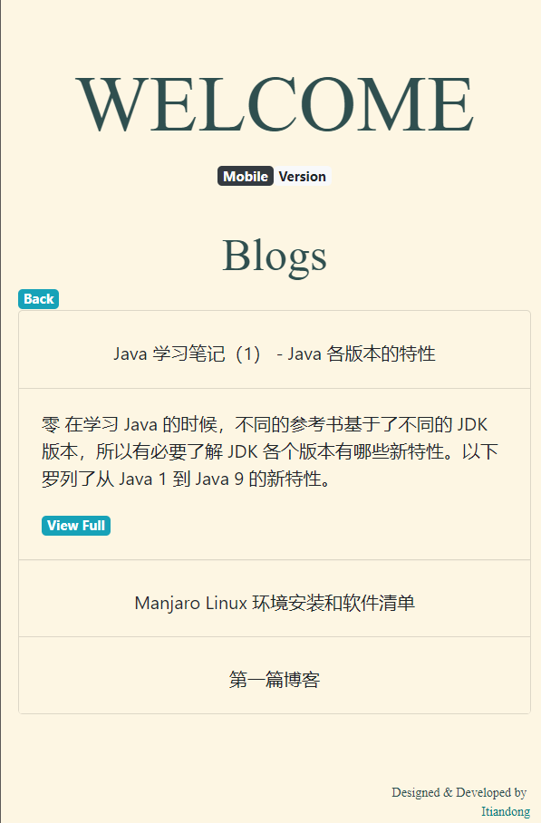

# My Website

[Github Pages](<http://itiandong.com/project0-itiandong>)

## Structure

### styles\style.scss

定义了全站的 CSS 样式，用到 `sass`，使用了`变量`和`继承`。

### js\MyJS.js

用来实现：

- 点 header 返回主页。
- 座右铭的点击切换。
- tag 点击展开。

### index.html

- 主页，包含了4个部分。
- 各个部分可点击，鼠标 hover 的时候有样式改变。

- 每个部分点击后会展开，展开的子元素使用到了`bootstrap组件`、表格、列表或者图片。

- 展开后会有`view more`链接指向相应子页面。

- `名言`点击后会切换下一条。

- 分为手机版和电脑版，对应做了显示优化：如电脑版`名言` hover 后会有抖动特效，手机上不存在 hover 的概念，就改为下划线暗示可以点击。

- 另外，任何页面上点击最大的标题可以返回主页。

### photo.html

- 展示每张图片和图片注释。
- 点`Back`可以返回主页。

### blogs.html

### friends.html

基本与`photo.html`相同

## Self Check

- [x] Your website must contain at least four different .html pages, and it should be possible to get from any page on your website to any other page by following one or more hyperlinks.
- [x] Your website must include at least one list (ordered or unordered), at least one table, and at least one image.
- [x] Your website must have at least one stylesheet file.
- [x] Your stylesheet(s) must use at least five different CSS properties, and at least five different types of CSS selectors. You must use the #id selector at least once, and the .class selector at least once.
- [x] Your stylesheet(s) must include at least one mobile-responsive @media query, such that something about the styling changes for smaller screens.
- [x] You must use Bootstrap 4 on your website, taking advantage of at least one [Bootstrap component](https://getbootstrap.com/docs/4.2/components/), and using at least two Bootstrap columns for layout purposes using [Bootstrap’s grid model](https://getbootstrap.com/docs/4.2/layout/grid/).
- [x] Your stylesheets must use at least one SCSS variable, at least one example of SCSS nesting, and at least one use of SCSS inheritance.
- [x] In README.md , include a short writeup describing your project, what’s contained in each file, and (optionally) any other additional information the staff should know about your project.